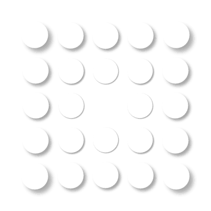

### Welcome to my GitHub page!

---

:clock12: [**Personal website**](https://asjadnaqvi.github.io/)

:clock1: [Notes on the recent **Difference-in-Difference (DiD)** literature](https://asjadnaqvi.github.io/DiD/)

:clock2: [**The Stata Guide** on Medium](https://medium.com/the-stata-guide) 
-   [GitHub](https://github.com/asjadnaqvi/The-Stata-Guide) • [The Du Bois Challenge](https://github.com/asjadnaqvi/DuBoisChallenge-Stata) • [#30DayMapChallenge 2021](https://github.com/asjadnaqvi/30DayMapChallenge2021) • [Stata schemes](https://github.com/asjadnaqvi/Stata-schemes)

:clock3: [**Europe COVID-19 Regional Tracker**](https://github.com/asjadnaqvi/COVID19-European-Regional-Tracker)

:clock4: My **Stata** packages:

|Package|Version|Updated|Documentation|
|----| ---- | ---- | ----- |
| [joyplot](https://github.com/asjadnaqvi/stata-joyplot) | 1.1 | 08.Apr.2022 | Package for joyplots |
| [streamplot](https://github.com/asjadnaqvi/stata-streamplot) | 1.1 | 08.Apr.2022 | Package for streamplots |
| [clipgeo](https://github.com/asjadnaqvi/stata-clipgeo) | 1.0 | 04.Apr.2022 | Polygon and polyline shapefile clipping |
| [delaunay](https://github.com/asjadnaqvi/stata-delaunay-voronoi) | 1.11 | 06.Mar.2022 | Delauanay triangulation, convex hull, voronoi tesselations |
| [schemepack](https://github.com/asjadnaqvi/Stata-schemes) | 1.1 | 05.Mar.2022 | A suite of Stata schemes |
| [drdid](https://github.com/friosavila/csdid_drdid) | 0.1 | 22.May.2021 | Doubly robust DiD estimator based on [Sant'Anna and Zhao (2020)](https://psantanna.com/DRDID/) |

 
 

 

### Connect with me:

[][website]
[][linkedin]
[][researchgate]
[][googlescholar]
[][twitter]
[][medium]
[][discord]
[][upwork]

[website]: https://asjadnaqvi.github.io/
[twitter]: https://twitter.com/AsjadNaqvi
[medium]: https://medium.com/the-stata-guide
[discord]: https://discord.gg/qpHZtX6Xkk
[linkedin]:https://www.linkedin.com/in/asjadnaqvi
[researchgate]: https://www.researchgate.net/profile/Asjad-Naqvi-2
[googlescholar]: https://scholar.google.com/citations?user=oWGGVpYAAAAJ&hl=en
[upwork]: https://www.upwork.com/freelancers/~010f9b79421dbba638
  
  

<!---  --->

<!---   --->

<!---  --->

<!--- | [bimap](https://github.com/asjadnaqvi/stata-bimap) | 1.0 | 08.Apr.2022 | Package for bi-variate maps | --->

 <!---*1: Mathematics is the language of nature. 2: Everything around us can be represented and understood through numbers. 3: If you graph the numbers of any system, patterns emerge. (Pi, 1998)* --->

